# 🔐 Spec: Authentication Flow

[⬅️ Back](./README.md) | [🏠 Docs Root](../../../../README.md)

**Status:** Draft

## 1. Security Constants

These values should be defined in `src/backend-fastapi/core/config.py`.

| Parameter | Value | Description |
| :--- | :--- | :--- |
| **ACCESS_TOKEN_EXPIRE** | 30 minutes | Short-lived token. If stolen, the attacker has access for only 30 minutes. |
| **REFRESH_TOKEN_EXPIRE** | 30 days | Long-lived token. Allows the user to stay logged in for a month. |
| **ALGORITHM** | HS256 | JWT signing algorithm. |

## 2. Token Types

### A. Access Token (Stateless)

*   **Type:** JWT (JSON Web Token).
*   **Storage (Server):** Not stored. Validated only by signature and expiration (`exp`).
*   **Storage (Client):** In JS application memory (variable).
*   **Payload:** `sub` (user_id), `exp` (expiration time), `type="access"`.

### B. Refresh Token (Stateful)

*   **Type:** Opaque String (random string) or JWT.
*   **Storage (Server):** Stored in DB (`refresh_tokens` table). This is a **White List** — only tokens in the database are considered valid.
*   **Storage (Client):** `localStorage` (for MVP) or `HttpOnly Cookie` (Best Practice, but harder with CORS). Currently using JSON in `localStorage`.
*   **Role:** The only task is to obtain a new pair of tokens.

## 3. Scenarios (Flows)

### Scenario 1: Login

1.  **Client:** Sends `POST /auth/login` (email, password).
2.  **Server:**
    *   Verifies password.
    *   Generates `access_token` (JWT).
    *   Generates `refresh_token` (use `secrets.token_urlsafe(32)` for 256-bit entropy).
    *   **DB:** Saves `refresh_token` + `user_id` + `expires_at` to `refresh_tokens` table.
3.  **Client:** Receives token pair, saves Access to memory, Refresh to LocalStorage.

### Scenario 2: Request to Protected Resource

1.  **Client:** Makes request with header `Authorization: Bearer <access_token>`.
2.  **Server:**
    *   Decodes JWT.
    *   Verifies signature (Secret Key).
    *   Verifies `exp` (not expired).
    *   *Note: Does not query DB (fast!).*
3.  **Result:** If OK — returns data. If error — `401 Unauthorized`.

### Scenario 3: Token Refresh (Refresh Rotation) 🔥

The most important process. We use **Refresh Token Rotation** to protect against theft.

```mermaid
sequenceDiagram
    autonumber
    participant C as Client
    participant S as Server
    participant DB as Database

    C->>S: POST /auth/refresh (old_refresh_token)
    S->>DB: Find token in whitelist
    
    alt Token Not Found / Expired
        DB-->>S: None
        S-->>C: 401 Unauthorized (Redirect to Login)
    else Token Valid
        DB-->>S: Token Record
        Note right of S: 🔄 ROTATION START
        S->>DB: DELETE old_refresh_token
        S->>S: Generate New Access + New Refresh
        S->>DB: Save New Refresh
        Note right of S: 🔄 ROTATION END
        S-->>C: 200 OK (New Access + New Refresh)
    end
```

1.  **Client:** Receives `401` on a regular request. Understands Access is expired.
2.  **Client:** Sends `POST /auth/refresh` (refresh_token).
3.  **Server:**
    *   Searches for token in `refresh_tokens` table.
    *   **If not found:** Error `401` (hack or logout). Client must Redirect to Login.
    *   **If found but expired:** Deletes from DB, error `401`.
    *   **If valid:**
        1.  **DELETES** old `refresh_token` from DB (one-time use!).
        2.  Generates a completely new pair (New Access + New Refresh).
        3.  Saves New Refresh to DB.
4.  **Client:** Replaces tokens locally and repeats the original request.

### Scenario 4: Logout

1.  **Client:** Sends `POST /auth/logout`.
2.  **Server:** Deletes the specific `refresh_token` from DB.
3.  **Result:** Access token still lives for its X minutes (JWT trade-off), but cannot be refreshed.

### Scenario 5: "Logout from all devices"

*   **Logic:** Delete **ALL** records from `refresh_tokens` for the given `user_id`.
