# 🔄 Data Flow

[⬅️ Back](./README.md) | [🏠 Docs Root](../../../../README.md)

To avoid "spaghetti code", data always flows strictly in one direction.

## Visual Flow

```mermaid
flowchart LR
    Client([Client])

    subgraph API [Presentation Layer]
        Router["📡 Router"]
        SchemaIn["📝 Pydantic Schema (In)"]
        SchemaOut["📦 Pydantic Schema (Out)"]
    end

    subgraph Domain [Business Logic]
        Service["⚙️ Service"]
    end

    subgraph Infra [Data Layer]
        Repo["🗄️ Repository"]
        DB[("🛢️ Database")]
    end

    Client -- JSON Request --> Router
    Router -- Validate --> SchemaIn
    SchemaIn -- DTO --> Service
    Service -- Domain Model --> Repo
    Repo -- SQL --> DB

    DB -- Row --> Repo
    Repo -- Domain Model --> Service
    Service -- Domain Model --> Router
    Router -- Serialize --> SchemaOut
    SchemaOut -- JSON Response --> Client
```

## Step-by-Step

1.  **Request** arrives at **API (Router)**.
2.  API validates input data via **Schemas (Pydantic)**.
3.  API passes clean data to **Service**.
4.  Service performs magic (hashing, file saving, calculations) and accesses **DB**.
5.  Service returns result (DB model or domain object) back to **API**.
6.  API converts this to **Response Schema (JSON)** and sends to client.
